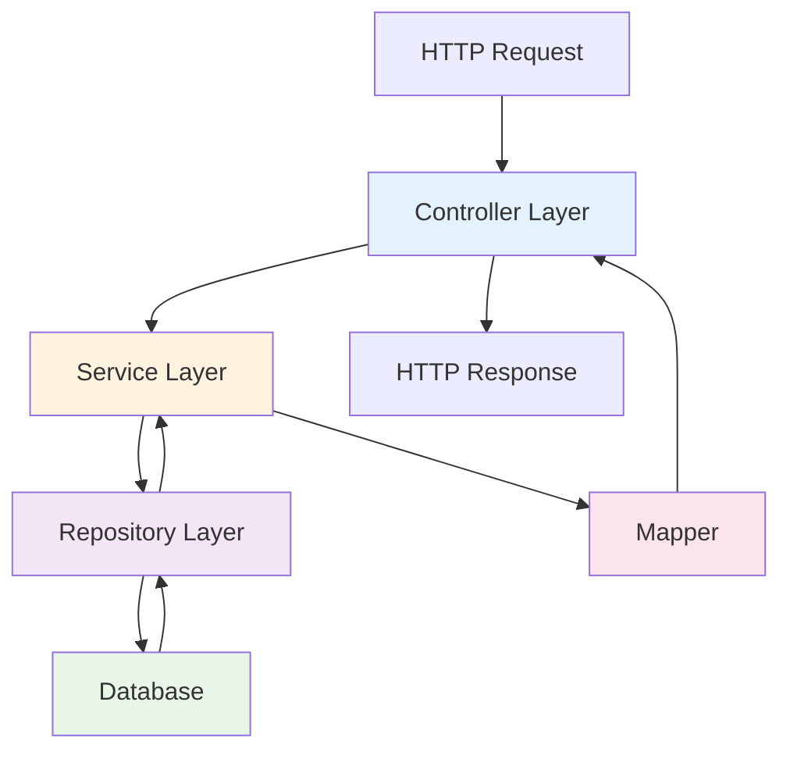
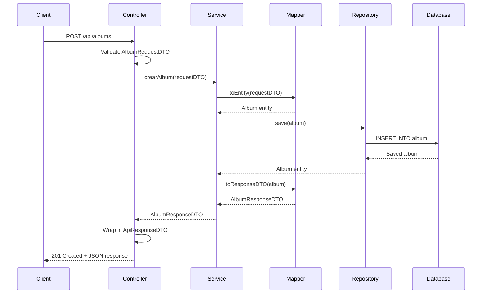

## Overview

The Album Collection Manager API follows a **layered MVC (Model-View-Controller) architecture** pattern with clear separation of concerns across four main layers:

<Steps>
  <Step title="Controller Layer">
    Handles HTTP requests and responses
  </Step>
  <Step title="Service Layer">
    Contains business logic and orchestrates operations
  </Step>
  <Step title="Repository Layer">
    Manages data access and database queries
  </Step>
  <Step title="Model Layer">
    Defines domain entities and database schema
  </Step>
</Steps>

## Architecture Diagram



## Layer Responsibilities

### Controller Layer

The controller layer acts as the entry point for all HTTP requests and is responsible for:

- Receiving and validating HTTP requests
- Invoking appropriate service methods
- Wrapping responses in standardized `ApiResponseDTO` format
- Handling HTTP status codes

<CodeGroup>
```java AlbumController.java
package ipss.web2.examen.controllers.api;

@RestController
@RequestMapping("/api/albums")
@RequiredArgsConstructor
@Tag(name = "Albumes", description = "Endpoints para gestionar albumes")
public class AlbumController {
    
    private final AlbumService albumService;
    
    @PostMapping
    public ResponseEntity<ApiResponseDTO<AlbumResponseDTO>> crearAlbum(
            @Valid @RequestBody AlbumRequestDTO requestDTO) {
        AlbumResponseDTO response = albumService.crearAlbum(requestDTO);
        return ResponseEntity.status(HttpStatus.CREATED)
                .body(ApiResponseDTO.created(response, "Álbum creado exitosamente"));
    }
    
    @GetMapping("/{id}")
    public ResponseEntity<ApiResponseDTO<AlbumResponseDTO>> obtenerAlbumPorId(
            @PathVariable Long id) {
        AlbumResponseDTO response = albumService.obtenerAlbumPorId(id);
        return ResponseEntity.ok(ApiResponseDTO.ok(response, "Álbum recuperado exitosamente"));
    }
}
```
</CodeGroup>

<Note>
  Controllers use `@Valid` for automatic DTO validation and always return `ResponseEntity<ApiResponseDTO<T>>` for consistent response formatting.
</Note>

### Service Layer

The service layer contains the core business logic and orchestration:

- Implements business rules and validation
- Coordinates operations across multiple repositories
- Manages transactions with `@Transactional`
- Uses mappers to convert between DTOs and entities

<CodeGroup>
```java AlbumService.java
@Service
@RequiredArgsConstructor
@Transactional
public class AlbumService {
    
    private final AlbumRepository albumRepository;
    private final AlbumMapper albumMapper;
    private final LaminaRepository laminaRepository;
    private final LaminaCatalogoRepository laminaCatalogoRepository;
    
    // Crear un nuevo album
    public AlbumResponseDTO crearAlbum(AlbumRequestDTO requestDTO) {
        Album album = albumMapper.toEntity(requestDTO);
        Album albumGuardado = albumRepository.save(album);
        return albumMapper.toResponseDTO(albumGuardado);
    }
    
    // Obtener un album por ID
    @Transactional(readOnly = true)
    public AlbumResponseDTO obtenerAlbumPorId(Long id) {
        Album album = albumRepository.findById(id)
                .orElseThrow(() -> new ResourceNotFoundException("Album", "ID", id));
        return albumMapper.toResponseDTO(album);
    }
    
    // Eliminar (desactivar) un album - Soft Delete
    public void eliminarAlbum(Long id) {
        Album album = albumRepository.findById(id)
                .orElseThrow(() -> new ResourceNotFoundException("Album", "ID", id));
        
        album.setActive(false); // Soft delete
        albumRepository.save(album);
    }
}
```
</CodeGroup>

<Tip>
  Use `@Transactional(readOnly = true)` for read-only operations to optimize database performance.
</Tip>

### Repository Layer

The repository layer provides data access through Spring Data JPA:

- Extends `JpaRepository` for basic CRUD operations
- Defines custom query methods using Spring Data naming conventions
- Supports filtering by `active` status for soft delete functionality

<CodeGroup>
```java AlbumRepository.java
@Repository
public interface AlbumRepository extends JpaRepository<Album, Long> {
    List<Album> findByActiveTrue();
    List<Album> findByActive(Boolean active);
    List<Album> findByYearAndActive(Integer year, Boolean active);
    List<Album> findByYearAndActiveTrue(Integer year);
    Optional<Album> findByIdAndActiveTrue(Long id);
    
    Page<Album> findByActiveTrue(Pageable pageable);
    Page<Album> findByYearAndActive(Integer year, Boolean active, Pageable pageable);
}
```

```java LaminaRepository.java
@Repository
public interface LaminaRepository extends JpaRepository<Lamina, Long> {
    List<Lamina> findByAlbumIdAndActiveTrue(Long albumId);
    List<Lamina> findByActiveTrue();
    List<Lamina> findByAlbumAndActiveTrue(Album album);
    List<Lamina> findByAlbumAndNombreAndActiveTrue(Album album, String nombre);
    long countByAlbumAndActiveTrue(Album album);
    
    @Query("select count(distinct l.nombre) from Lamina l where l.album = :album and l.active = true")
    long countDistinctNombreByAlbumAndActiveTrue(@Param("album") Album album);
}
```
</CodeGroup>

### Model Layer

The model layer defines JPA entities that map to database tables:

- Uses Lombok annotations for boilerplate code reduction
- Implements JPA auditing with `@CreatedDate` and `@LastModifiedDate`
- Defines relationships between entities
- Includes soft delete support via `active` field

See [Data Model](/concepts/data-model) for detailed entity structure.

## Request/Response Flow

Here's how a typical API request flows through the architecture:



<Steps>
  <Step title="Request Validation">
    Controller receives request and validates the DTO using `@Valid`
  </Step>
  <Step title="Service Invocation">
    Controller calls the appropriate service method
  </Step>
  <Step title="Entity Mapping">
    Service uses mapper to convert DTO to entity
  </Step>
  <Step title="Data Persistence">
    Service calls repository to persist data
  </Step>
  <Step title="Response Mapping">
    Service uses mapper to convert entity to response DTO
  </Step>
  <Step title="Response Wrapping">
    Controller wraps response in `ApiResponseDTO` with metadata
  </Step>
</Steps>

## Key Design Patterns

### Dependency Injection

All layers use **constructor-based dependency injection** via Lombok's `@RequiredArgsConstructor`:

```java
@Service
@RequiredArgsConstructor
public class AlbumService {
    private final AlbumRepository albumRepository;
    private final AlbumMapper albumMapper;
    // Dependencies are automatically injected
}
```

### DTO Pattern

The API uses **Data Transfer Objects (DTOs)** to decouple external API contracts from internal domain models:

- **Request DTOs**: Validate incoming data with Jakarta Validation annotations
- **Response DTOs**: Control which fields are exposed to clients
- **Mappers**: Convert between DTOs and entities (manual, not MapStruct)

### Repository Pattern

Spring Data JPA repositories abstract database operations:

- Auto-implementation of CRUD methods
- Query derivation from method names
- Custom queries with `@Query` annotation

## Transaction Management

<CardGroup cols={2}>
  <Card title="Write Operations" icon="pen">
    Use `@Transactional` at the service class level. All write operations are transactional by default.
  </Card>
  <Card title="Read Operations" icon="book">
    Use `@Transactional(readOnly = true)` for optimized read-only operations.
  </Card>
</CardGroup>

```java
@Service
@RequiredArgsConstructor
@Transactional // Default for all methods
public class AlbumService {
    
    @Transactional(readOnly = true) // Override for reads
    public AlbumResponseDTO obtenerAlbumPorId(Long id) {
        // Read-only optimization
    }
    
    public AlbumResponseDTO crearAlbum(AlbumRequestDTO requestDTO) {
        // Transactional write
    }
}
```

## Error Handling

The architecture includes centralized error handling through `GlobalExceptionHandler`:

```java
@RestControllerAdvice
public class GlobalExceptionHandler {
    
    @ExceptionHandler(ResourceNotFoundException.class)
    public ResponseEntity<ApiResponseDTO<Void>> handleResourceNotFound(
            ResourceNotFoundException ex) {
        return ResponseEntity.status(HttpStatus.NOT_FOUND)
            .body(ApiResponseDTO.error(
                ex.getMessage(), 
                "RESOURCE_NOT_FOUND"
            ));
    }
}
```

<Check>
  All exceptions are caught and transformed into consistent `ApiResponseDTO` error responses.
</Check>

## Package Structure

```
ipss.web2.examen
├── controllers/api/         # REST Controllers
│   ├── AlbumController.java
│   └── LaminaController.java
├── services/                # Business Logic
│   ├── AlbumService.java
│   └── LaminaService.java
├── repositories/            # Data Access
│   ├── AlbumRepository.java
│   ├── LaminaRepository.java
│   └── LaminaCatalogoRepository.java
├── models/                  # JPA Entities
│   ├── Album.java
│   ├── Lamina.java
│   └── LaminaCatalogo.java
├── dtos/                    # Request/Response DTOs
├── mappers/                 # DTO ↔ Entity Converters
├── exceptions/              # Custom Exceptions
└── config/                  # Configuration Classes
```

## Best Practices

<AccordionGroup>
  <Accordion title="Service Layer Guidelines">
    - Keep controllers thin - move business logic to services
    - Use `@Transactional` appropriately
    - Throw custom exceptions for business rule violations
    - Always use mappers to convert between DTOs and entities
  </Accordion>
  
  <Accordion title="Repository Guidelines">
    - Use Spring Data query derivation when possible
    - Use `@Query` for complex queries
    - Always include `active` status filtering for soft-deleted entities
    - Return `Optional<T>` for single-result queries
  </Accordion>
  
  <Accordion title="Controller Guidelines">
    - Validate all inputs with `@Valid`
    - Use appropriate HTTP status codes (200, 201, 404, etc.)
    - Always wrap responses in `ApiResponseDTO`
    - Document endpoints with OpenAPI annotations
  </Accordion>
</AccordionGroup>

## Related Concepts

<CardGroup cols={2}>
  <Card title="Data Model" icon="database" href="/concepts/data-model">
    Explore the entity structure and relationships
  </Card>
  <Card title="Soft Delete" icon="trash" href="/concepts/soft-delete">
    Learn how soft delete is implemented across layers
  </Card>
  <Card title="Catalog System" icon="book-open" href="/concepts/catalog-system">
    Understand the catalog validation business logic
  </Card>
</CardGroup>