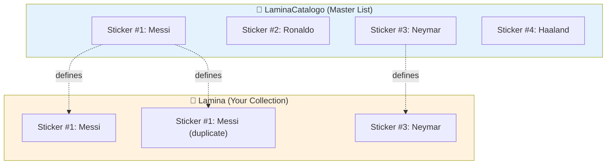
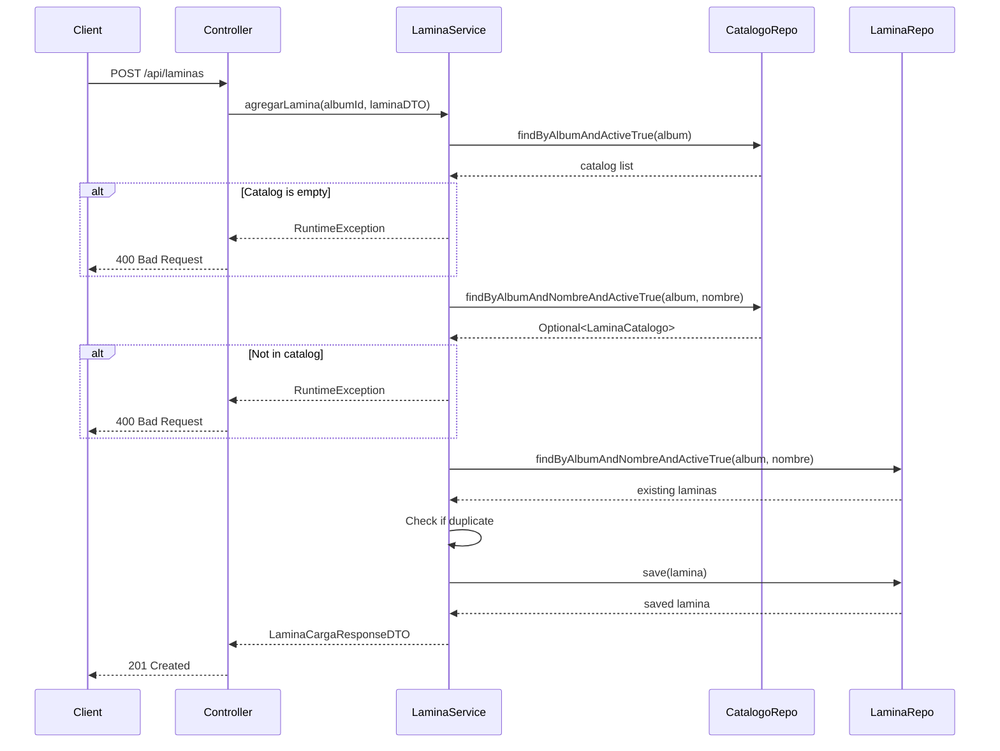

## Overview

The **Catalog System** is a core business feature that validates all sticker additions against a predefined catalog of allowed stickers for each album. This ensures:

<CardGroup cols={2}>
  <Card title="Data Integrity" icon="shield-check">
    Only valid stickers defined in the catalog can be added
  </Card>
  <Card title="Duplicate Detection" icon="copy">
    System tracks and reports repeated stickers
  </Card>
  <Card title="Collection Tracking" icon="chart-line">
    Know which stickers you have and which are missing
  </Card>
  <Card title="Business Rules" icon="gavel">
    Enforces catalog-first workflow
  </Card>
</CardGroup>

## Core Concepts

### Catalog vs. Owned Laminas



<Info>
  **LaminaCatalogo** defines what stickers *exist* for an album. **Lamina** represents what stickers you *own* (including duplicates).
</Info>

## Business Rules

The catalog system enforces these critical rules:

<Steps>
  <Step title="Catalog Must Be Created First">
    Before adding any stickers to an album, you **must** create the catalog that defines all possible stickers.
    
    ```java
    // ❌ Trying to add a lamina without catalog fails
    POST /api/laminas
    // Response: "Debe crear un catálogo de láminas primero"
    ```
  </Step>
  
  <Step title="Catalog Is Created Only Once">
    An album can have only **one catalog**. Attempting to create a second catalog throws an error.
    
    ```java
    // ❌ Trying to create catalog twice
    POST /api/albums/1/catalogo
    // Response: "Este álbum ya tiene un catálogo de láminas definido"
    ```
  </Step>
  
  <Step title="Laminas Must Exist in Catalog">
    Every sticker you add **must** exist in the album's catalog (validated by name).
    
    ```java
    // ❌ Adding a lamina not in catalog
    POST /api/laminas {"nombre": "Invalid Sticker"}
    // Response: "La lámina 'Invalid Sticker' NO existe en el catálogo"
    ```
  </Step>
  
  <Step title="Unique Constraint on Catalog">
    Each sticker name appears **exactly once** in the catalog per album (enforced by database constraint).
    
    ```java
    @Table(name = "lamina_catalogo", uniqueConstraints = {
        @UniqueConstraint(columnNames = {"album_id", "nombre"})
    })
    ```
  </Step>
</Steps>

## Creating a Catalog

### Endpoint

```http
POST /api/albums/{albumId}/catalogo
Content-Type: application/json
```

### Request Example

<CodeGroup>
```json Request Body
[
  {
    "nombre": "Sticker #1: Lionel Messi",
    "imagen": "https://example.com/messi.jpg",
    "fechaLanzamiento": "2024-01-15",
    "tipoLamina": "Jugador"
  },
  {
    "nombre": "Sticker #2: Cristiano Ronaldo",
    "imagen": "https://example.com/ronaldo.jpg",
    "fechaLanzamiento": "2024-01-15",
    "tipoLamina": "Jugador"
  },
  {
    "nombre": "Sticker #3: Neymar Jr",
    "imagen": "https://example.com/neymar.jpg",
    "fechaLanzamiento": "2024-01-15",
    "tipoLamina": "Especial"
  }
]
```

```json Success Response (201 Created)
{
  "success": true,
  "message": "Catálogo creado exitosamente con 3 láminas",
  "data": [
    {
      "id": 1,
      "nombre": "Sticker #1: Lionel Messi",
      "imagen": "https://example.com/messi.jpg",
      "fechaLanzamiento": "2024-01-15",
      "tipoLamina": "Jugador",
      "createdAt": "2024-03-15T10:00:00",
      "updatedAt": "2024-03-15T10:00:00"
    },
    // ... more catalog entries
  ],
  "timestamp": "2024-03-15T10:00:00"
}
```
</CodeGroup>

### Service Implementation

<CodeGroup>
```java LaminaService.java (src/main/java/ipss/web2/examen/services/LaminaService.java:41-60)
// Crear catálogo de láminas para un álbum
public List<LaminaCatalogoResponseDTO> crearCatalogo(
        Long albumId, 
        List<LaminaCatalogoRequestDTO> laminasCatalogo) {
    
    // Buscar el álbum
    Album album = albumRepository.findById(albumId)
            .orElseThrow(() -> new ResourceNotFoundException("Álbum", "ID", albumId));
    
    // Validar que no exista catálogo previo
    long existentes = laminaCatalogoRepository.countByAlbumAndActiveTrue(album);
    if (existentes > 0) {
        throw new RuntimeException(
            "Este álbum ya tiene un catálogo de láminas definido"
        );
    }
    
    return laminasCatalogo.stream()
        .map(dto -> {
            LaminaCatalogo catalogo = laminaMapper.toCatalogoEntity(dto, album);
            return laminaCatalogoRepository.save(catalogo);
        })
        .map(laminaMapper::toCatalogoResponseDTO)
        .collect(Collectors.toList());
}
```
</CodeGroup>

<Warning>
  The catalog can only be created **once** per album. Subsequent attempts will throw a `RuntimeException`.
</Warning>

## Validating Laminas Against Catalog

When adding a sticker to your collection, the system validates it against the catalog:

### Single Lamina Addition

<CodeGroup>
```java LaminaService.java (src/main/java/ipss/web2/examen/services/LaminaService.java:62-101)
// Agregar una lámina validando catálogo y detectando repetidas
public LaminaCargaResponseDTO agregarLamina(Long albumId, LaminaRequestDTO laminaDTO) {
    // Buscar el álbum
    Album album = albumRepository.findById(albumId)
            .orElseThrow(() -> new ResourceNotFoundException("Álbum", "ID", albumId));
    
    // Validar que el catálogo exista
    List<LaminaCatalogo> catalogo = laminaCatalogoRepository.findByAlbumAndActiveTrue(album);
    if (catalogo.isEmpty()) {
        throw new RuntimeException("Debe crear un catálogo de láminas primero");
    }
    
    // Buscar si la lámina existe en el catálogo (OBLIGATORIO)
    Optional<LaminaCatalogo> enCatalogo = laminaCatalogoRepository
        .findByAlbumAndNombreAndActiveTrue(album, laminaDTO.getNombre());
    
    // VALIDACIÓN: Lámina DEBE estar en catálogo
    if (enCatalogo.isEmpty()) {
        throw new RuntimeException(
            "❌ ERROR: La lámina '" + laminaDTO.getNombre() + "' NO existe en el catálogo del álbum. " +
            "Solo puedes agregar láminas que están definidas en el catálogo."
        );
    }
    
    // Buscar si ya existen copias de esta lámina (duplicate detection)
    List<Lamina> laminasExistentes = laminaRepository
        .findByAlbumAndNombreAndActiveTrue(album, laminaDTO.getNombre());
    boolean esRepetida = !laminasExistentes.isEmpty();
    int cantidadTotal = laminasExistentes.size() + 1;
    
    // Crear y guardar la lámina
    Lamina lamina = laminaMapper.toEntity(laminaDTO, album);
    Lamina laminaGuardada = laminaRepository.save(lamina);
    
    return new LaminaCargaResponseDTO(
        esRepetida,
        true,  // Always true because we validated catalog
        cantidadTotal,
        laminaMapper.toResponseDTO(laminaGuardada)
    );
}
```
</CodeGroup>

<Steps>
  <Step title="Retrieve Album">
    Find the album by ID
  </Step>
  <Step title="Validate Catalog Exists">
    Ensure a catalog has been created for this album
  </Step>
  <Step title="Check Catalog Entry">
    Search for the sticker name in `lamina_catalogo`
  </Step>
  <Step title="Reject Invalid Stickers">
    Throw exception if sticker is not in catalog
  </Step>
  <Step title="Detect Duplicates">
    Check if this sticker already exists in the collection
  </Step>
  <Step title="Save Lamina">
    Create the lamina record (even if it's a duplicate)
  </Step>
</Steps>

### Bulk Lamina Addition

For bulk operations, validation happens per sticker with case-insensitive name matching:

<CodeGroup>
```java LaminaService.java (src/main/java/ipss/web2/examen/services/LaminaService.java:248-280)
// Procesar una lámina individual en la carga masiva
private LaminaCargueMasivoResponseDTO procesarLaminaIndividual(
        LaminaRequestDTO laminaDTO, 
        Album album, 
        List<LaminaCatalogo> catalogo) {
    try {
        // Verificar si está en catálogo (case-insensitive)
        boolean estaEnCatalogo = catalogo.stream()
            .anyMatch(cat -> cat.getNombre().equalsIgnoreCase(laminaDTO.getNombre()));
        
        if (!estaEnCatalogo) {
            return construirResultadoError(laminaDTO.getNombre(), 
                "❌ NO AGREGADA: No está en el catálogo");
        }
        
        // Buscar láminas existentes con el mismo nombre
        List<Lamina> laminasExistentes = laminaRepository
            .findByAlbumAndNombreAndActiveTrue(album, laminaDTO.getNombre());
        
        boolean esRepetida = !laminasExistentes.isEmpty();
        
        // Crear y guardar la lámina
        Lamina lamina = laminaMapper.toEntity(laminaDTO, album);
        Lamina laminaGuardada = laminaRepository.save(lamina);
        
        int cantidadTotal = laminasExistentes.size() + 1;
        
        return construirResultadoExitoso(laminaGuardada, esRepetida, cantidadTotal);
        
    } catch (Exception e) {
        return construirResultadoError(laminaDTO.getNombre(), "❌ ERROR: " + e.getMessage());
    }
}
```
</CodeGroup>

<Note>
  Bulk operations use **case-insensitive** matching (`equalsIgnoreCase`) for more flexible validation.
</Note>

## Duplicate Detection

The system tracks duplicate stickers in your collection:

### How Duplicates Work

```mermaid
graph LR
    A[Add "Messi" #1] --> B[cantidadTotal: 1, esRepetida: false]
    B --> C[Add "Messi" #2]
    C --> D[cantidadTotal: 2, esRepetida: true]
    D --> E[Add "Messi" #3]
    E --> F[cantidadTotal: 3, esRepetida: true]
    
    style B fill:#e8f5e9
    style D fill:#fff3e0
    style F fill:#fff3e0
```

### Response Format

<CodeGroup>
```json First Addition (Not Duplicate)
{
  "success": true,
  "message": "Lámina agregada exitosamente",
  "data": {
    "esRepetida": false,
    "estaEnCatalogo": true,
    "cantidadRepetidas": 1,
    "lamina": {
      "id": 101,
      "nombre": "Sticker #1: Messi",
      "albumId": 1
    }
  }
}
```

```json Second Addition (Duplicate Detected)
{
  "success": true,
  "message": "Lámina agregada exitosamente",
  "data": {
    "esRepetida": true,
    "estaEnCatalogo": true,
    "cantidadRepetidas": 2,
    "lamina": {
      "id": 102,
      "nombre": "Sticker #1: Messi",
      "albumId": 1
    }
  }
}
```
</CodeGroup>

<Check>
  **Both stickers are saved** - the `esRepetida` flag just indicates it's a duplicate for tracking purposes.
</Check>

## Collection Status Tracking

The catalog system enables comprehensive collection tracking:

### Get Collection Status

```http
GET /api/albums/{albumId}/catalogo/estado
```

<CodeGroup>
```json Response
{
  "success": true,
  "data": {
    "laminasPoseidas": [
      {"id": 101, "nombre": "Sticker #1: Messi"},
      {"id": 102, "nombre": "Sticker #1: Messi"},
      {"id": 103, "nombre": "Sticker #3: Neymar"}
    ],
    "laminasFaltantes": [
      {"id": 2, "nombre": "Sticker #2: Ronaldo"},
      {"id": 4, "nombre": "Sticker #4: Haaland"}
    ],
    "laminasRepetidas": {
      "Sticker #1: Messi": 2
    },
    "totalLaminas": 3,
    "laminasFaltantesTotal": 2,
    "laminasRepetidasTotal": 2
  }
}
```
</CodeGroup>

### Status Calculation Logic

<CodeGroup>
```java LaminaService.java (src/main/java/ipss/web2/examen/services/LaminaService.java:104-149)
@Transactional(readOnly = true)
public LaminasEstadoDTO obtenerEstado(Long albumId) {
    Album album = albumRepository.findById(albumId)
            .orElseThrow(() -> new ResourceNotFoundException("Álbum", "ID", albumId));
    
    // Obtener catálogo completo
    List<LaminaCatalogo> catalogoCompleto = 
        laminaCatalogoRepository.findByAlbumAndActiveTrue(album);
    
    // Obtener láminas poseídas
    List<Lamina> laminasPoseidas = 
        laminaRepository.findByAlbumAndActiveTrue(album);
    
    // Crear set de nombres poseídos (unique)
    Set<String> nombresPoseidos = laminasPoseidas.stream()
        .map(Lamina::getNombre)
        .collect(Collectors.toSet());
    
    // FALTANTES: en catálogo pero no poseídas
    List<LaminaCatalogoResponseDTO> laminasFaltantes = catalogoCompleto.stream()
        .filter(catalogo -> !nombresPoseidos.contains(catalogo.getNombre()))
        .map(laminaMapper::toCatalogoResponseDTO)
        .collect(Collectors.toList());
    
    // REPETIDAS: contar copias de cada lámina
    Map<String, Integer> laminasRepetidas = laminasPoseidas.stream()
        .collect(Collectors.groupingBy(
            Lamina::getNombre,
            Collectors.summingInt(l -> 1)
        ))
        .entrySet().stream()
        .filter(e -> e.getValue() > 1)  // Only count > 1
        .collect(Collectors.toMap(Map.Entry::getKey, Map.Entry::getValue));
    
    // Totals
    int totalLaminas = laminasPoseidas.size();
    int laminasFaltantesTotal = laminasFaltantes.size();
    int laminasRepetidasTotal = laminasRepetidas.values().stream()
        .mapToInt(Integer::intValue)
        .sum();
    
    return new LaminasEstadoDTO(
        laminasDTO, 
        laminasFaltantes, 
        laminasRepetidas, 
        totalLaminas, 
        laminasFaltantesTotal, 
        laminasRepetidasTotal
    );
}
```
</CodeGroup>

<Info>
  **Missing stickers** are calculated by comparing the catalog (all possible stickers) with your collection (owned stickers).
</Info>

## Database Constraints

### Unique Catalog Constraint

The database enforces uniqueness at the schema level:

<CodeGroup>
```java LaminaCatalogo.java (src/main/java/ipss/web2/examen/models/LaminaCatalogo.java:15-17)
@Table(name = "lamina_catalogo", uniqueConstraints = {
    @UniqueConstraint(columnNames = {"album_id", "nombre"})
})
```

```sql SQL Equivalent
ALTER TABLE lamina_catalogo
ADD CONSTRAINT uk_album_nombre 
UNIQUE (album_id, nombre);
```
</CodeGroup>

<Warning>
  Attempting to insert a duplicate catalog entry will result in a `DataIntegrityViolationException`.
</Warning>

## Validation Flow Diagram



## Error Scenarios

<AccordionGroup>
  <Accordion title="Catalog Not Created">
    **Request:**
    ```http
    POST /api/laminas
    {"albumId": 1, "nombre": "Messi"}
    ```
    
    **Response:**
    ```json
    {
      "success": false,
      "message": "Debe crear un catálogo de láminas primero",
      "errorCode": "RUNTIME_ERROR",
      "timestamp": "2024-03-15T10:30:00"
    }
    ```
  </Accordion>
  
  <Accordion title="Lamina Not in Catalog">
    **Request:**
    ```http
    POST /api/laminas
    {"albumId": 1, "nombre": "Invalid Sticker"}
    ```
    
    **Response:**
    ```json
    {
      "success": false,
      "message": "❌ ERROR: La lámina 'Invalid Sticker' NO existe en el catálogo del álbum. Solo puedes agregar láminas que están definidas en el catálogo.",
      "errorCode": "LAMINA_NOT_IN_CATALOG",
      "timestamp": "2024-03-15T10:30:00"
    }
    ```
  </Accordion>
  
  <Accordion title="Duplicate Catalog Creation">
    **Request:**
    ```http
    POST /api/albums/1/catalogo
    [...catalog entries...]
    ```
    
    **Response (if catalog already exists):**
    ```json
    {
      "success": false,
      "message": "Este álbum ya tiene un catálogo de láminas definido",
      "errorCode": "RUNTIME_ERROR",
      "timestamp": "2024-03-15T10:30:00"
    }
    ```
  </Accordion>
</AccordionGroup>

## Complete Workflow Example

<Steps>
  <Step title="Create Album">
    ```http
    POST /api/albums
    {"nombre": "FIFA World Cup 2024", "year": 2024}
    ```
    Response: `{"id": 1, "nombre": "FIFA World Cup 2024"}`
  </Step>
  
  <Step title="Create Catalog">
    ```http
    POST /api/albums/1/catalogo
    [
      {"nombre": "Messi", "tipoLamina": "Jugador", "fechaLanzamiento": "2024-01-15"},
      {"nombre": "Ronaldo", "tipoLamina": "Jugador", "fechaLanzamiento": "2024-01-15"}
    ]
    ```
    Catalog is now defined with 2 stickers.
  </Step>
  
  <Step title="Add Valid Sticker">
    ```http
    POST /api/laminas
    {"albumId": 1, "nombre": "Messi", "tipoLamina": "Jugador", "fechaLanzamiento": "2024-01-15"}
    ```
    Response: `{"esRepetida": false, "estaEnCatalogo": true, "cantidadRepetidas": 1}`
  </Step>
  
  <Step title="Add Duplicate Sticker">
    ```http
    POST /api/laminas
    {"albumId": 1, "nombre": "Messi", "tipoLamina": "Jugador", "fechaLanzamiento": "2024-01-15"}
    ```
    Response: `{"esRepetida": true, "estaEnCatalogo": true, "cantidadRepetidas": 2}`
  </Step>
  
  <Step title="Try Invalid Sticker">
    ```http
    POST /api/laminas
    {"albumId": 1, "nombre": "Neymar", "tipoLamina": "Jugador", "fechaLanzamiento": "2024-01-15"}
    ```
    Response: `400 Bad Request - "La lámina 'Neymar' NO existe en el catálogo"`
  </Step>
  
  <Step title="Check Collection Status">
    ```http
    GET /api/albums/1/catalogo/estado
    ```
    Response:
    ```json
    {
      "laminasPoseidas": [{"nombre": "Messi"}, {"nombre": "Messi"}],
      "laminasFaltantes": [{"nombre": "Ronaldo"}],
      "laminasRepetidas": {"Messi": 2},
      "totalLaminas": 2,
      "laminasFaltantesTotal": 1,
      "laminasRepetidasTotal": 2
    }
    ```
  </Step>
</Steps>

## Best Practices

<CardGroup cols={2}>
  <Card title="Always Create Catalog First" icon="1">
    Define the complete catalog before allowing users to add stickers
  </Card>
  <Card title="Use Descriptive Names" icon="tag">
    Catalog entries should have clear, unique names (e.g., "Sticker #42: Player Name")
  </Card>
  <Card title="Handle Duplicates Gracefully" icon="copy">
    Accept duplicates but track them for reporting and trading features
  </Card>
  <Card title="Validate Early" icon="shield-check">
    Fail fast with clear error messages if catalog validation fails
  </Card>
</CardGroup>

## Related Concepts

<CardGroup cols={3}>
  <Card title="Data Model" icon="database" href="/concepts/data-model">
    See the LaminaCatalogo and Lamina entity definitions
  </Card>
  <Card title="Architecture" icon="layer-group" href="/concepts/architecture">
    Understand how catalog validation flows through layers
  </Card>
  <Card title="Soft Delete" icon="trash" href="/concepts/soft-delete">
    Learn how active filtering applies to catalog queries
  </Card>
</CardGroup>