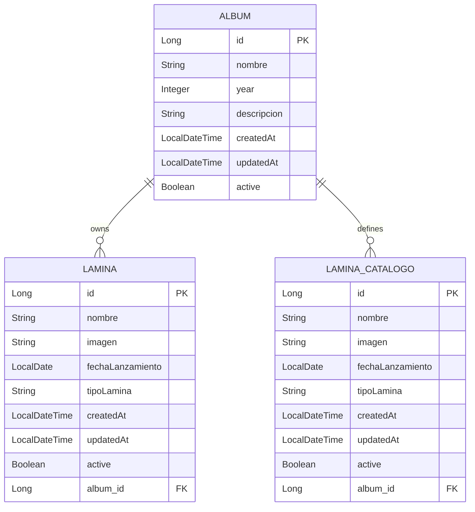

## Overview

The Album Collection Manager uses three core entities to model the album collection domain:

<CardGroup cols={3}>
  <Card title="Album" icon="compact-disc">
    Represents a collectible album
  </Card>
  <Card title="Lamina" icon="image">
    Represents owned stickers/cards
  </Card>
  <Card title="LaminaCatalogo" icon="book-open">
    Defines available stickers for an album
  </Card>
</CardGroup>

## Entity Relationship Diagram



## Album Entity

The `Album` entity represents a collectible album (e.g., sports cards, sticker albums).

### Entity Definition

<CodeGroup>
```java Album.java (src/main/java/ipss/web2/examen/models/Album.java:1-64)
@Entity
@Table(name = "album", indexes = {
        @Index(name = "idx_album_release_year", columnList = "release_year"),
        @Index(name = "idx_album_is_active", columnList = "is_active"),
        @Index(name = "idx_album_nombre", columnList = "nombre")
})
@Getter
@Setter
@Builder
@NoArgsConstructor
@AllArgsConstructor
@ToString(exclude = {"laminas", "laminasCatalogo"})
@EqualsAndHashCode(onlyExplicitlyIncluded = true)
@EntityListeners(AuditingEntityListener.class)
public class Album {
    @Id
    @GeneratedValue(strategy = GenerationType.IDENTITY)
    @EqualsAndHashCode.Include
    private Long id;

    @Column(name = "nombre", nullable = false, length = 100)
    private String nombre;

    @Column(name = "release_year", nullable = false)
    private Integer year;

    @Column(name = "descripcion", length = 500)
    private String descripcion;

    @CreatedDate
    @Column(name = "created_at", updatable = false)
    private LocalDateTime createdAt;

    @LastModifiedDate
    @Column(name = "updated_at")
    private LocalDateTime updatedAt;

    @Builder.Default
    @Column(name = "is_active")
    private Boolean active = true;

    @Builder.Default
    @OneToMany(mappedBy = "album", cascade = {CascadeType.PERSIST, CascadeType.MERGE}, fetch = FetchType.LAZY)
    private List<Lamina> laminas = new ArrayList<>();

    @Builder.Default
    @OneToMany(mappedBy = "album", cascade = {CascadeType.PERSIST, CascadeType.MERGE}, fetch = FetchType.LAZY)
    private List<LaminaCatalogo> laminasCatalogo = new ArrayList<>();
}
```
</CodeGroup>

### Field Reference

| Field | Type | Database Column | Constraints | Description |
|-------|------|-----------------|-------------|-------------|
| `id` | Long | `id` | PK, AUTO_INCREMENT | Unique identifier |
| `nombre` | String | `nombre` | NOT NULL, max 100 chars | Album name |
| `year` | Integer | `release_year` | NOT NULL | Release year |
| `descripcion` | String | `descripcion` | max 500 chars | Album description |
| `createdAt` | LocalDateTime | `created_at` | Auto-populated | Creation timestamp |
| `updatedAt` | LocalDateTime | `updated_at` | Auto-updated | Last modification timestamp |
| `active` | Boolean | `is_active` | default `true` | Soft delete flag |
| `laminas` | List\<Lamina\> | - | One-to-Many | Owned stickers |
| `laminasCatalogo` | List\<LaminaCatalogo\> | - | One-to-Many | Catalog stickers |

### Database Indexes

<AccordionGroup>
  <Accordion title="idx_album_release_year">
    Optimizes queries filtering by release year
  </Accordion>
  <Accordion title="idx_album_is_active">
    Speeds up soft delete filtering (active/inactive albums)
  </Accordion>
  <Accordion title="idx_album_nombre">
    Improves search performance by album name
  </Accordion>
</AccordionGroup>

### JPA Annotations

<Tabs>
  <Tab title="Auditing">
    ```java
    @EntityListeners(AuditingEntityListener.class)
    public class Album {
        @CreatedDate
        @Column(name = "created_at", updatable = false)
        private LocalDateTime createdAt;
        
        @LastModifiedDate
        @Column(name = "updated_at")
        private LocalDateTime updatedAt;
    }
    ```
    Automatically tracks creation and modification timestamps.
  </Tab>
  <Tab title="Relationships">
    ```java
    @OneToMany(mappedBy = "album", 
               cascade = {CascadeType.PERSIST, CascadeType.MERGE}, 
               fetch = FetchType.LAZY)
    private List<Lamina> laminas = new ArrayList<>();
    ```
    Lazy-loaded relationships to avoid N+1 query problems.
  </Tab>
  <Tab title="Lombok">
    ```java
    @Getter
    @Setter
    @Builder
    @NoArgsConstructor
    @AllArgsConstructor
    @ToString(exclude = {"laminas", "laminasCatalogo"})
    @EqualsAndHashCode(onlyExplicitlyIncluded = true)
    ```
    Reduces boilerplate code with auto-generated methods.
  </Tab>
</Tabs>

## Lamina Entity

The `Lamina` entity represents a sticker/card that a user owns in their collection.

### Entity Definition

<CodeGroup>
```java Lamina.java (src/main/java/ipss/web2/examen/models/Lamina.java:1-58)
@Entity
@Table(name = "lamina")
@Getter
@Setter
@Builder
@NoArgsConstructor
@AllArgsConstructor
@ToString(exclude = {"album"})
@EqualsAndHashCode(onlyExplicitlyIncluded = true)
@EntityListeners(AuditingEntityListener.class)
public class Lamina {
    @Id
    @GeneratedValue(strategy = GenerationType.IDENTITY)
    @EqualsAndHashCode.Include
    private Long id;

    @Column(name = "nombre", nullable = false, length = 100)
    private String nombre;

    @Column(name = "imagen")
    private String imagen;

    @Column(name = "fecha_lanzamiento", nullable = false)
    private LocalDate fechaLanzamiento;

    @Column(name = "tipo_lamina", nullable = false)
    private String tipoLamina;

    @CreatedDate
    @Column(name = "created_at", updatable = false)
    private LocalDateTime createdAt;

    @LastModifiedDate
    @Column(name = "updated_at")
    private LocalDateTime updatedAt;

    @Builder.Default
    @Column(name = "is_active")
    private Boolean active = true;

    @ManyToOne
    @JoinColumn(name = "album_id", nullable = false)
    private Album album;
}
```
</CodeGroup>

### Field Reference

| Field | Type | Database Column | Constraints | Description |
|-------|------|-----------------|-------------|-------------|
| `id` | Long | `id` | PK, AUTO_INCREMENT | Unique identifier |
| `nombre` | String | `nombre` | NOT NULL, max 100 chars | Sticker name/number |
| `imagen` | String | `imagen` | nullable | Image URL |
| `fechaLanzamiento` | LocalDate | `fecha_lanzamiento` | NOT NULL | Release date |
| `tipoLamina` | String | `tipo_lamina` | NOT NULL | Type (e.g., "regular", "special") |
| `createdAt` | LocalDateTime | `created_at` | Auto-populated | Creation timestamp |
| `updatedAt` | LocalDateTime | `updated_at` | Auto-updated | Last modification timestamp |
| `active` | Boolean | `is_active` | default `true` | Soft delete flag |
| `album` | Album | `album_id` | FK, NOT NULL | Parent album reference |

<Note>
  Multiple `Lamina` records can have the same `nombre` for the same album, representing duplicate stickers in a user's collection.
</Note>

## LaminaCatalogo Entity

The `LaminaCatalogo` entity defines the master catalog of all possible stickers for an album.

### Entity Definition

<CodeGroup>
```java LaminaCatalogo.java (src/main/java/ipss/web2/examen/models/LaminaCatalogo.java:1-60)
@Entity
@Table(name = "lamina_catalogo", uniqueConstraints = {
    @UniqueConstraint(columnNames = {"album_id", "nombre"})
})
@Getter
@Setter
@Builder
@NoArgsConstructor
@AllArgsConstructor
@ToString(exclude = {"album"})
@EqualsAndHashCode(onlyExplicitlyIncluded = true)
@EntityListeners(AuditingEntityListener.class)
public class LaminaCatalogo {
    @Id
    @GeneratedValue(strategy = GenerationType.IDENTITY)
    @EqualsAndHashCode.Include
    private Long id;

    @Column(name = "nombre", nullable = false, length = 100)
    private String nombre;

    @Column(name = "imagen")
    private String imagen;

    @Column(name = "fecha_lanzamiento", nullable = false)
    private LocalDate fechaLanzamiento;

    @Column(name = "tipo_lamina", nullable = false)
    private String tipoLamina;

    @CreatedDate
    @Column(name = "created_at", updatable = false)
    private LocalDateTime createdAt;

    @LastModifiedDate
    @Column(name = "updated_at")
    private LocalDateTime updatedAt;

    @Builder.Default
    @Column(name = "is_active")
    private Boolean active = true;

    @ManyToOne
    @JoinColumn(name = "album_id", nullable = false)
    private Album album;
}
```
</CodeGroup>

### Unique Constraint

<Warning>
  The `(album_id, nombre)` combination must be UNIQUE. You cannot have two catalog entries with the same name in the same album.
</Warning>

```java
@Table(name = "lamina_catalogo", uniqueConstraints = {
    @UniqueConstraint(columnNames = {"album_id", "nombre"})
})
```

This constraint ensures:
- Each sticker name appears only once per album in the catalog
- Data integrity for catalog validation
- Prevention of duplicate catalog definitions

## Entity Relationships

### Album → Lamina (One-to-Many)

```java
// In Album.java
@OneToMany(mappedBy = "album", 
           cascade = {CascadeType.PERSIST, CascadeType.MERGE}, 
           fetch = FetchType.LAZY)
private List<Lamina> laminas = new ArrayList<>();

// In Lamina.java
@ManyToOne
@JoinColumn(name = "album_id", nullable = false)
private Album album;
```

<Info>
  An album can have **many laminas** (owned stickers), including duplicates. The relationship is lazy-loaded to optimize performance.
</Info>

### Album → LaminaCatalogo (One-to-Many)

```java
// In Album.java
@OneToMany(mappedBy = "album", 
           cascade = {CascadeType.PERSIST, CascadeType.MERGE}, 
           fetch = FetchType.LAZY)
private List<LaminaCatalogo> laminasCatalogo = new ArrayList<>();

// In LaminaCatalogo.java
@ManyToOne
@JoinColumn(name = "album_id", nullable = false)
private Album album;
```

<Info>
  An album has **one catalog** that defines all possible stickers. Each catalog entry is unique per album.
</Info>

## JPA Auditing

All entities use **automatic auditing** to track creation and modification times:

<Steps>
  <Step title="Enable JPA Auditing">
    Configuration class enables auditing:
    ```java
    @Configuration
    @EnableJpaAuditing
    public class JpaAuditingConfig {
    }
    ```
  </Step>
  <Step title="Add Entity Listener">
    Entities register the auditing listener:
    ```java
    @EntityListeners(AuditingEntityListener.class)
    public class Album {
    ```
  </Step>
  <Step title="Annotate Timestamp Fields">
    Fields are automatically populated:
    ```java
    @CreatedDate
    @Column(name = "created_at", updatable = false)
    private LocalDateTime createdAt;
    
    @LastModifiedDate
    @Column(name = "updated_at")
    private LocalDateTime updatedAt;
    ```
  </Step>
</Steps>

<Check>
  Timestamps are managed automatically - you never need to set them manually.
</Check>

## Soft Delete Pattern

All entities implement **soft delete** using the `active` field:

```java
@Builder.Default
@Column(name = "is_active")
private Boolean active = true;
```

<CardGroup cols={2}>
  <Card title="Default Behavior" icon="check">
    New entities are created with `active = true`
  </Card>
  <Card title="Delete Operation" icon="trash">
    DELETE sets `active = false` (never removes from DB)
  </Card>
  <Card title="Query Filtering" icon="filter">
    Repositories filter by `active = true` by default
  </Card>
  <Card title="Data Preservation" icon="shield">
    Historical data is preserved for auditing
  </Card>
</CardGroup>

See [Soft Delete Implementation](/concepts/soft-delete) for more details.

## Database Schema

### Album Table

```sql
CREATE TABLE album (
    id BIGINT AUTO_INCREMENT PRIMARY KEY,
    nombre VARCHAR(100) NOT NULL,
    release_year INT NOT NULL,
    descripcion VARCHAR(500),
    created_at DATETIME(6),
    updated_at DATETIME(6),
    is_active BOOLEAN DEFAULT TRUE,
    INDEX idx_album_release_year (release_year),
    INDEX idx_album_is_active (is_active),
    INDEX idx_album_nombre (nombre)
);
```

### Lamina Table

```sql
CREATE TABLE lamina (
    id BIGINT AUTO_INCREMENT PRIMARY KEY,
    nombre VARCHAR(100) NOT NULL,
    imagen VARCHAR(255),
    fecha_lanzamiento DATE NOT NULL,
    tipo_lamina VARCHAR(255) NOT NULL,
    created_at DATETIME(6),
    updated_at DATETIME(6),
    is_active BOOLEAN DEFAULT TRUE,
    album_id BIGINT NOT NULL,
    FOREIGN KEY (album_id) REFERENCES album(id)
);
```

### LaminaCatalogo Table

```sql
CREATE TABLE lamina_catalogo (
    id BIGINT AUTO_INCREMENT PRIMARY KEY,
    nombre VARCHAR(100) NOT NULL,
    imagen VARCHAR(255),
    fecha_lanzamiento DATE NOT NULL,
    tipo_lamina VARCHAR(255) NOT NULL,
    created_at DATETIME(6),
    updated_at DATETIME(6),
    is_active BOOLEAN DEFAULT TRUE,
    album_id BIGINT NOT NULL,
    FOREIGN KEY (album_id) REFERENCES album(id),
    UNIQUE KEY uk_album_nombre (album_id, nombre)
);
```

## Common Query Patterns

### Find Active Albums

```java
List<Album> albums = albumRepository.findByActiveTrue();
```

### Find Laminas for an Album

```java
List<Lamina> laminas = laminaRepository.findByAlbumAndActiveTrue(album);
```

### Check for Duplicate Laminas

```java
List<Lamina> duplicates = laminaRepository
    .findByAlbumAndNombreAndActiveTrue(album, "Sticker #42");
boolean hasDuplicates = duplicates.size() > 1;
```

### Validate Against Catalog

```java
Optional<LaminaCatalogo> catalogEntry = laminaCatalogoRepository
    .findByAlbumAndNombreAndActiveTrue(album, "Sticker #42");
boolean isValid = catalogEntry.isPresent();
```

## Related Concepts

<CardGroup cols={3}>
  <Card title="Architecture" icon="layer-group" href="/concepts/architecture">
    Understand how entities fit into the layered architecture
  </Card>
  <Card title="Soft Delete" icon="trash" href="/concepts/soft-delete">
    Learn about the soft delete implementation
  </Card>
  <Card title="Catalog System" icon="book-open" href="/concepts/catalog-system">
    Explore catalog validation business rules
  </Card>
</CardGroup>