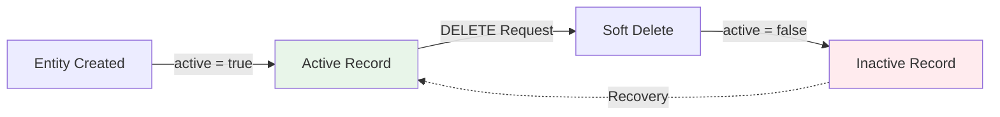

## What is Soft Delete?

**Soft delete** is a data management pattern where records are marked as "deleted" rather than being physically removed from the database. This approach:

<CardGroup cols={2}>
  <Card title="Preserves Data" icon="database">
    Records remain in the database for auditing and recovery
  </Card>
  <Card title="Maintains Integrity" icon="shield">
    Foreign key relationships stay intact
  </Card>
  <Card title="Enables Recovery" icon="trash-undo">
    Accidentally deleted data can be restored
  </Card>
  <Card title="Supports Compliance" icon="gavel">
    Meets regulatory requirements for data retention
  </Card>
</CardGroup>

## Implementation Overview

All entities in the Album Collection Manager implement soft delete using a boolean `active` field:



## The `active` Field

Every entity includes an `active` field with these characteristics:

<CodeGroup>
```java Album.java (src/main/java/ipss/web2/examen/models/Album.java:52-54)
@Builder.Default
@Column(name = "is_active")
private Boolean active = true;
```

```java Lamina.java (src/main/java/ipss/web2/examen/models/Lamina.java:49-51)
@Builder.Default
@Column(name = "is_active")
private Boolean active = true;
```

```java LaminaCatalogo.java (src/main/java/ipss/web2/examen/models/LaminaCatalogo.java:52-54)
@Builder.Default
@Column(name = "is_active")
private Boolean active = true;
```
</CodeGroup>

<Tabs>
  <Tab title="Default Value">
    The `@Builder.Default` annotation ensures new entities are created with `active = true`.
  </Tab>
  <Tab title="Database Column">
    Maps to the `is_active` column in the database (Boolean/TINYINT type).
  </Tab>
  <Tab title="Nullability">
    Never null - always `true` (active) or `false` (soft-deleted).
  </Tab>
</Tabs>

## Service Layer Implementation

The service layer handles soft delete operations by setting `active = false`:

### Album Soft Delete

<CodeGroup>
```java AlbumService.java (src/main/java/ipss/web2/examen/services/AlbumService.java:127-134)
// Eliminar (desactivar) un album
public void eliminarAlbum(Long id) {
    Album album = albumRepository.findById(id)
            .orElseThrow(() -> new ResourceNotFoundException("Album", "ID", id));
    
    album.setActive(false);  // Soft delete - mark as inactive
    albumRepository.save(album);
}
```
</CodeGroup>

<Warning>
  Notice that the album is **not** removed from the database. The `active` flag is simply set to `false`.
</Warning>

### Lamina Soft Delete

<CodeGroup>
```java LaminaService.java (src/main/java/ipss/web2/examen/services/LaminaService.java:210-217)
// Eliminar (desactivar) una lámina
public void eliminarLamina(Long id) {
    Lamina lamina = laminaRepository.findById(id)
            .orElseThrow(() -> new ResourceNotFoundException("Lámina", "ID", id));
    
    lamina.setActive(false);  // Soft delete
    laminaRepository.save(lamina);
}
```
</CodeGroup>

<Info>
  The pattern is consistent across all entities - find the record, set `active = false`, and save.
</Info>

## Repository Layer Filtering

Repositories provide methods that filter by the `active` status, ensuring soft-deleted records don't appear in standard queries:

### Album Repository

<CodeGroup>
```java AlbumRepository.java (src/main/java/ipss/web2/examen/repositories/AlbumRepository.java:1-30)
@Repository
public interface AlbumRepository extends JpaRepository<Album, Long> {
    // Find only active albums
    List<Album> findByActiveTrue();
    
    // Find albums by active status (true or false)
    List<Album> findByActive(Boolean active);
    
    // Find active albums by year
    List<Album> findByYearAndActiveTrue(Integer year);
    
    // Find albums by year and active status
    List<Album> findByYearAndActive(Integer year, Boolean active);
    
    // Find by ID only if active
    Optional<Album> findByIdAndActiveTrue(Long id);
    
    // Paginated queries with active filtering
    Page<Album> findByActiveTrue(Pageable pageable);
    Page<Album> findByYearAndActive(Integer year, Boolean active, Pageable pageable);
}
```
</CodeGroup>

<Tip>
  Most methods end with `...AndActiveTrue()` to automatically exclude soft-deleted records.
</Tip>

### Lamina Repository

<CodeGroup>
```java LaminaRepository.java (src/main/java/ipss/web2/examen/repositories/LaminaRepository.java:1-25)
@Repository
public interface LaminaRepository extends JpaRepository<Lamina, Long> {
    // Find active laminas for an album (by album ID)
    List<Lamina> findByAlbumIdAndActiveTrue(Long albumId);
    
    // Find all active laminas
    List<Lamina> findByActiveTrue();
    
    // Find active laminas for an album (by album entity)
    List<Lamina> findByAlbumAndActiveTrue(Album album);
    
    // Find active laminas by album and name (for duplicate detection)
    List<Lamina> findByAlbumAndNombreAndActiveTrue(Album album, String nombre);
    
    // Count active laminas for an album
    long countByAlbumAndActiveTrue(Album album);
    
    // Count distinct lamina names for an album (active only)
    @Query("select count(distinct l.nombre) from Lamina l where l.album = :album and l.active = true")
    long countDistinctNombreByAlbumAndActiveTrue(@Param("album") Album album);
}
```
</CodeGroup>

### LaminaCatalogo Repository

<CodeGroup>
```java LaminaCatalogoRepository.java (src/main/java/ipss/web2/examen/repositories/LaminaCatalogoRepository.java:1-19)
@Repository
public interface LaminaCatalogoRepository extends JpaRepository<LaminaCatalogo, Long> {
    // Find active catalog entries for an album
    List<LaminaCatalogo> findByAlbumAndActiveTrue(Album album);
    
    // Find active catalog entry by album and name
    Optional<LaminaCatalogo> findByAlbumAndNombreAndActiveTrue(Album album, String nombre);
    
    // Count active catalog entries for an album
    long countByAlbumAndActiveTrue(Album album);
}
```
</CodeGroup>

<Check>
  All repository methods include `active` filtering to ensure soft-deleted records are excluded from results.
</Check>

## Controller Layer Response

When a DELETE request succeeds, the controller returns a success message:

<CodeGroup>
```java AlbumController.java (src/main/java/ipss/web2/examen/controllers/api/AlbumController.java:78-83)
// DELETE /api/albums/{id} - Eliminar álbum (soft delete)
@DeleteMapping("/{id}")
public ResponseEntity<ApiResponseDTO<Void>> eliminarAlbum(@PathVariable Long id) {
    albumService.eliminarAlbum(id);
    return ResponseEntity.ok(ApiResponseDTO.ok("Álbum con ID: " + id + " ha sido marcado como inactivo"));
}
```
</CodeGroup>

Example response:

```json
{
  "success": true,
  "message": "Álbum con ID: 5 ha sido marcado como inactivo",
  "data": null,
  "timestamp": "2024-03-15T10:30:00"
}
```

<Note>
  The message explicitly states the record is "marked as inactive" rather than "deleted", clarifying the soft delete behavior.
</Note>

## Query Comparison

### Hard Delete (NOT Used)

```java
// ❌ Hard delete - permanently removes record
public void eliminarAlbum(Long id) {
    Album album = albumRepository.findById(id)
            .orElseThrow(() -> new ResourceNotFoundException("Album", "ID", id));
    albumRepository.delete(album);  // Permanently deleted!
}
```

<Warning>
  Hard deletes are **never** used in this system. Once deleted, data cannot be recovered.
</Warning>

### Soft Delete (Used)

```java
// ✅ Soft delete - marks as inactive
public void eliminarAlbum(Long id) {
    Album album = albumRepository.findById(id)
            .orElseThrow(() -> new ResourceNotFoundException("Album", "ID", id));
    album.setActive(false);  // Marked inactive, still in DB
    albumRepository.save(album);
}
```

<Check>
  Soft deletes preserve the record in the database with `active = false`.
</Check>

## Querying Active vs. Inactive Records

### Get Only Active Records (Default)

<CodeGroup>
```java Service Layer
@Transactional(readOnly = true)
public List<AlbumResponseDTO> obtenerTodosLosAlbums() {
    // Returns only active albums
    return albumRepository.findByActiveTrue()
            .stream()
            .map(albumMapper::toResponseDTO)
            .collect(Collectors.toList());
}
```
</CodeGroup>

### Get Inactive Records (When Needed)

```java
// Find inactive (soft-deleted) albums
List<Album> inactiveAlbums = albumRepository.findByActive(false);

// Find all albums (both active and inactive)
List<Album> allAlbums = albumRepository.findAll();
```

<Info>
  Use `findByActive(false)` when you need to query soft-deleted records (e.g., for admin recovery features).
</Info>

## Benefits in Practice

### Data Recovery Example

Imagine a user accidentally deletes an album:

<Steps>
  <Step title="User Deletes Album">
    ```http
    DELETE /api/albums/42
    ```
    Album #42 is marked `active = false`
  </Step>
  <Step title="Record Still Exists">
    ```sql
    SELECT * FROM album WHERE id = 42;
    -- Returns: id=42, nombre="FIFA 2024", is_active=0
    ```
    The record is still in the database
  </Step>
  <Step title="Admin Can Recover">
    ```java
    // Recovery service method
    public void reactivarAlbum(Long id) {
        Album album = albumRepository.findById(id)
            .orElseThrow(() -> new ResourceNotFoundException("Album", "ID", id));
        album.setActive(true);
        albumRepository.save(album);
    }
    ```
    Setting `active = true` restores the album
  </Step>
</Steps>

### Audit Trail Example

Soft delete enables complete audit trails:

```sql
-- See when an album was created and soft-deleted
SELECT 
    id,
    nombre,
    created_at,
    updated_at,
    is_active
FROM album
WHERE id = 42;

-- Result:
-- id | nombre      | created_at          | updated_at          | is_active
-- 42 | FIFA 2024   | 2024-01-15 10:00:00 | 2024-03-15 15:30:00 | 0
```

<Info>
  The `updated_at` timestamp shows when the album was soft-deleted (when `active` was changed to `false`).
</Info>

## Cascade Behavior

Soft delete in this system is **non-cascading**:

```java
@OneToMany(mappedBy = "album", 
           cascade = {CascadeType.PERSIST, CascadeType.MERGE}, 
           fetch = FetchType.LAZY)
private List<Lamina> laminas = new ArrayList<>();
```

<Warning>
  Notice that `CascadeType.REMOVE` is **NOT** included. When an album is soft-deleted, its laminas are **NOT** automatically deleted.
</Warning>

### Behavior Comparison

<Tabs>
  <Tab title="Current (Non-Cascading)">
    When you soft-delete an album:
    ```java
    albumService.eliminarAlbum(42L);
    // Album #42: active = false
    // Laminas for album #42: active = true (unchanged)
    ```
    Child records remain active. They won't appear when querying by `album.activeTrue()`, but they're still in the database.
  </Tab>
  <Tab title="If It Were Cascading">
    If `CascadeType.REMOVE` were included:
    ```java
    albumService.eliminarAlbum(42L);
    // Album #42: active = false
    // All laminas for album #42: active = false (cascaded)
    ```
    This is NOT the current behavior.
  </Tab>
</Tabs>

<Info>
  If you need to soft-delete an album and all its laminas, you must explicitly handle the cascade in your service layer.
</Info>

## Database State Examples

### Before Soft Delete

```sql
SELECT id, nombre, is_active FROM album;
```

| id | nombre | is_active |
|----|--------|----------|
| 1  | FIFA 2024 | 1 |
| 2  | Pokemon 2024 | 1 |
| 3  | Marvel Heroes | 1 |

### After Soft Delete (Album #2)

```sql
-- Soft delete executed
UPDATE album SET is_active = 0, updated_at = NOW() WHERE id = 2;

SELECT id, nombre, is_active FROM album;
```

| id | nombre | is_active |
|----|--------|----------|
| 1  | FIFA 2024 | 1 |
| 2  | Pokemon 2024 | **0** |
| 3  | Marvel Heroes | 1 |

<Check>
  Record #2 is still in the database, just marked inactive.
</Check>

### Query Results

```java
// Only returns active albums (1 and 3)
List<Album> active = albumRepository.findByActiveTrue();
// Result: [Album{id=1}, Album{id=3}]

// Can still find the soft-deleted album by ID
Optional<Album> album2 = albumRepository.findById(2L);
// Result: Optional[Album{id=2, active=false}]

// Explicitly query inactive albums
List<Album> inactive = albumRepository.findByActive(false);
// Result: [Album{id=2}]
```

## Best Practices

<AccordionGroup>
  <Accordion title="Always Use Repository Methods with Active Filtering">
    ```java
    // ✅ Good - filters active records
    albumRepository.findByActiveTrue()
    
    // ⚠️ Caution - returns ALL records (including soft-deleted)
    albumRepository.findAll()
    ```
  </Accordion>
  
  <Accordion title="Never Hard Delete in Services">
    ```java
    // ❌ Never do this
    albumRepository.delete(album);
    albumRepository.deleteById(id);
    
    // ✅ Always do this
    album.setActive(false);
    albumRepository.save(album);
    ```
  </Accordion>
  
  <Accordion title="Document Soft Delete in API Responses">
    ```java
    return ResponseEntity.ok(
        ApiResponseDTO.ok("Álbum marcado como inactivo") // Clear messaging
    );
    ```
  </Accordion>
  
  <Accordion title="Consider Soft Delete in Business Logic">
    ```java
    // Validate that catalog exists AND is active
    List<LaminaCatalogo> catalogo = 
        laminaCatalogoRepository.findByAlbumAndActiveTrue(album);
    
    if (catalogo.isEmpty()) {
        throw new RuntimeException("Catálogo no encontrado o inactivo");
    }
    ```
  </Accordion>
</AccordionGroup>

## Recovery Operations (Future Enhancement)

While not currently exposed in the API, soft delete enables future recovery features:

<CodeGroup>
```java Example Recovery Service
@Service
public class RecoveryService {
    
    @Autowired
    private AlbumRepository albumRepository;
    
    // Restore a soft-deleted album
    @Transactional
    public AlbumResponseDTO reactivarAlbum(Long id) {
        Album album = albumRepository.findById(id)
            .orElseThrow(() -> new ResourceNotFoundException("Album", "ID", id));
        
        if (album.getActive()) {
            throw new InvalidOperationException(
                "El álbum ya está activo", 
                "ALBUM_ALREADY_ACTIVE"
            );
        }
        
        album.setActive(true);
        Album restored = albumRepository.save(album);
        return albumMapper.toResponseDTO(restored);
    }
    
    // List soft-deleted albums
    @Transactional(readOnly = true)
    public List<AlbumResponseDTO> obtenerAlbumsEliminados() {
        return albumRepository.findByActive(false)
            .stream()
            .map(albumMapper::toResponseDTO)
            .collect(Collectors.toList());
    }
}
```
</CodeGroup>

<Tip>
  Consider implementing admin endpoints for recovery: `POST /api/admin/albums/{id}/restore`
</Tip>

## Related Concepts

<CardGroup cols={3}>
  <Card title="Data Model" icon="database" href="/concepts/data-model">
    See how the active field is defined in entities
  </Card>
  <Card title="Architecture" icon="layer-group" href="/concepts/architecture">
    Understand how soft delete flows through layers
  </Card>
  <Card title="Catalog System" icon="book-open" href="/concepts/catalog-system">
    Learn how catalog validation handles inactive records
  </Card>
</CardGroup>